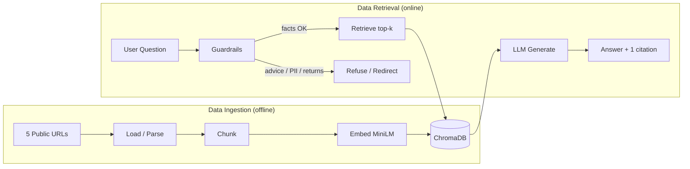
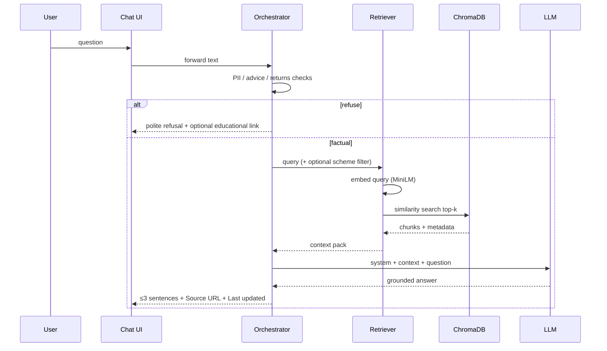

# Architecture: Mutual Fund Facts-Only RAG Chatbot

**Product:** HDFC Mutual Fund FAQ Assistant  
**Based on:** [PRD.md](./PRD.md)  
**Audience:** Class demo / milestone prototype  
**Last updated:** 2026-09-27

---

## 1. Overview

The system is a **Retrieval-Augmented Generation (RAG)** chatbot with two distinct pipelines:

1. **Data ingestion** (offline / setup-time) — Load → Chunk → Embed → Store  
2. **Data retrieval & answering** (runtime) — Query → Guardrails → Retrieve → Generate → Cite

Answers are grounded only in a fixed corpus of **5 public Groww pages** for HDFC Direct–Growth schemes. Every factual answer includes **one source URL**. Opinion/advice queries are refused.



---

## 2. High-level system context

| Actor / System | Role |
|----------------|------|
| Demo user | Asks factual MF questions via tiny chat UI |
| Chat UI | Welcome, 3 examples, disclaimer, Q&A |
| Ingestion job | Builds vector index from 5 URLs / snapshots |
| Retrieval service | Similarity search + grounded generation |
| ChromaDB | Local vector store + chunk metadata |
| Embedding model | `sentence-transformers/all-MiniLM-L6-v2` |
| LLM | Generates ≤3-sentence answers from retrieved context only |
| Public sources | Groww scheme pages (corpus of record) |

**No auth, no user DB, no PII storage.**

---

## 3. Component architecture

```
┌─────────────────────────────────────────────────────────────┐
│                         Chat UI                             │
│  welcome · 3 example Qs · disclaimer · input · answer pane  │
└────────────────────────────┬────────────────────────────────┘
                             │ question / response
                             ▼
┌─────────────────────────────────────────────────────────────┐
│                    Application / Orchestrator               │
│  · PII scrub / reject                                       │
│  · Advice & performance intent detection                    │
│  · Scheme hint extraction (optional metadata filter)        │
│  · Prompt assembly + answer formatting                      │
└───────────────┬─────────────────────────────┬───────────────┘
                │                             │
                ▼                             ▼
┌───────────────────────────┐   ┌─────────────────────────────┐
│   Retriever               │   │   Generator (LLM)           │
│   · embed query (MiniLM)  │   │   · context-only prompt     │
│   · Chroma similarity     │   │   · ≤3 sentences            │
│   · top-k chunks + meta   │   │   · cite best source_url    │
└─────────────┬─────────────┘   └─────────────────────────────┘
              │
              ▼
┌───────────────────────────┐
│   ChromaDB                │
│   vectors + metadata:     │
│   source_url, scheme_name,│
│   category, ingested_at   │
└───────────────────────────┘

┌─────────────────────────────────────────────────────────────┐
│              Ingestion Pipeline (separate path)             │
│  sources.md/csv → loader → cleaner → chunker → embedder     │
│                         → Chroma upsert                     │
└─────────────────────────────────────────────────────────────┘
```

---

## 4. RAG stage design

### 4.1 Data ingestion (setup-time)

| Stage | Responsibility | Implementation notes |
|-------|----------------|----------------------|
| **Load** | Fetch or read the 5 public pages | Prefer saved text/HTML **snapshots** for demo reliability; record `ingested_at` |
| **Clean** | Extract main scheme content | Strip nav/ads/boilerplate; keep headings + fee/SIP/risk sections |
| **Chunk** | Split into retrieval units | `RecursiveCharacterTextSplitter` — size ~500–800 chars, overlap ~80–120 |
| **Embed** | Vectorize each chunk | `sentence-transformers/all-MiniLM-L6-v2` |
| **Store** | Persist vectors + metadata | ChromaDB collection (e.g. `hdfc_mf_faqs`) |

**Chunk metadata (required)**

| Field | Purpose |
|-------|---------|
| `source_url` | Citation link returned to user |
| `scheme_name` | Optional filter when query names a fund |
| `category` | large_cap / flexi_cap / elss / small_cap / hybrid |
| `ingested_at` | Powers “Last updated from sources: …” |

**Chunking decision:** Recursive character splitting (not semantic). Scheme pages are sectioned facts; recursive split on `\n\n`, `\n`, `. ` is deterministic and easy to debug in a class demo. Semantic chunking is a fallback if retrieval quality is weak.

**Corpus (fixed)**

1. Large Cap — `hdfc-large-cap-fund-direct-growth`  
2. Flexi Cap — `hdfc-equity-fund-direct-growth`  
3. ELSS — `hdfc-elss-tax-saver-fund-direct-plan-growth`  
4. Small Cap — `hdfc-small-cap-fund-direct-growth`  
5. Balanced Advantage — `hdfc-balanced-advantage-fund-direct-growth`  

(Full URLs in PRD §5.1 / sources list deliverable.)

---

### 4.2 Data retrieval & generation (runtime)



| Stage | Responsibility |
|-------|----------------|
| **Guardrails** | Block/refuse advice, performance comparison, PII |
| **Retrieve** | Embed query; Chroma top-k (suggested `k=3–5`); optional `scheme_name` where filter |
| **Generate** | LLM answers **only** from retrieved chunks; if insufficient context → “not found in sources” |
| **Cite** | Attach exactly **one** `source_url` (best-matching / highest-ranked chunk’s page) |
| **Format** | ≤3 sentences + `Source:` + `Last updated from sources:` |

---

## 5. Technology stack

| Layer | Choice | Why (demo) |
|-------|--------|------------|
| Embeddings | `sentence-transformers/all-MiniLM-L6-v2` | PRD-locked; small, fast, local-friendly |
| Vector DB | ChromaDB | Simple local persistence; visible store stage |
| Chunking | RecursiveCharacterTextSplitter | Fits sectioned MF pages; deterministic |
| Orchestration | Python (LangChain or thin custom) | Clear stage boundaries for teaching |
| LLM | TBD (API or local) — must be context-grounded | Open decision in PRD |
| UI | Streamlit / Gradio / simple web | Tiny surface: welcome + examples + chat |
| Sources config | `sources.csv` or `sources.md` | Submission deliverable |

---

## 6. Suggested repository layout

```
27-NextLeap-2026/
├── docs/
│   ├── PRD.md
│   ├── architecture.md      ← this file
│   └── Problemstatement.txt
├── data/
│   ├── sources.csv          # 5 URLs + scheme metadata
│   └── snapshots/           # optional offline page text
├── chroma/                  # persisted vector store (gitignored if large)
├── src/
│   ├── ingest/
│   │   ├── load.py          # Load stage
│   │   ├── chunk.py         # Chunk stage
│   │   ├── embed_store.py   # Embed + Store stages
│   │   └── run_ingest.py    # CLI entry: full ingestion
│   ├── retrieve/
│   │   ├── retriever.py     # query embed + Chroma search
│   │   ├── guardrails.py    # advice / PII / returns
│   │   └── generate.py      # LLM + citation formatting
│   ├── app/
│   │   └── ui.py            # chat UI
│   └── config.py            # chunk size, k, model names, paths
├── samples/
│   └── sample_qa.md         # 5–10 Q&A for submission
├── README.md
└── requirements.txt
```

Ingestion and retrieval stay in **separate modules** so each RAG stage remains obvious for the demo.

---

## 7. Data contracts

### 7.1 Source record (`sources.csv`)

| Column | Example |
|--------|---------|
| `category` | `large_cap` |
| `scheme_name` | `HDFC Large Cap Fund Direct Growth` |
| `url` | `https://groww.in/mutual-funds/...` |

### 7.2 Stored chunk

```text
id:          stable hash(scheme + chunk_index)
text:        chunk body
embedding:   384-d MiniLM vector
metadata:
  source_url, scheme_name, category, ingested_at, chunk_index
```

### 7.3 API-ish orchestrator I/O (logical)

**Input:** `{ "question": string }`  

**Output (fact):**
```text
answer: "…"                 # ≤3 sentences
source: "<one URL>"
last_updated_from_sources: "<ISO date or ingest timestamp>"
refused: false
```

**Output (refuse):**
```text
answer: "I can only share facts from public scheme pages…"
source: "<optional educational / scheme URL>"
refused: true
```

---

## 8. Guardrails (cross-cutting)

| Check | Trigger examples | Behavior |
|-------|------------------|----------|
| Advice | “Should I buy?”, “best for me” | Refuse; no recommendation |
| Performance | “Which gives higher returns?” | Do not compute; link scheme/factsheet page |
| PII | PAN, Aadhaar, account, OTP, email, phone | Do not accept/store; ask user to remove |
| Missing context | Retrieval empty / irrelevant | “Not found in our sources” + cite closest scheme page if useful |
| Hallucination control | Any generation | Prompt: use only provided context; never invent numbers |

---

## 9. UI architecture (minimal)

Single view:

1. **Header / welcome** — product one-liner  
2. **Disclaimer** — “Facts-only. No investment advice.” (always visible)  
3. **3 example questions** — clickable → fill input  
4. **Chat** — user message + assistant reply (fact block or refusal)  
5. **Answer footer** — Source link + Last updated  

No cards-heavy dashboard; one job: ask a fact, get a cited answer.

---

## 10. Configuration defaults

| Parameter | Suggested default | Tunable? |
|-----------|-------------------|----------|
| `chunk_size` | 600 | Yes |
| `chunk_overlap` | 100 | Yes |
| `top_k` | 4 | Yes |
| Embedding model | `all-MiniLM-L6-v2` | No (locked) |
| Vector store | ChromaDB local path | Path only |
| Max answer sentences | 3 | Soft via prompt |

---

## 11. Failure modes & mitigations

| Failure | System behavior |
|---------|-----------------|
| Live fetch blocked / page changed | Fall back to `data/snapshots/`; show snapshot `ingested_at` |
| Chroma empty / not built | UI error: “Index missing — run ingestion first” |
| LLM unavailable | Show retrieved snippets + source URL as degraded mode (optional) or clear error |
| Ambiguous scheme in question | Retrieve across all; prefer chunks mentioning named scheme; if unclear, ask which of the 5 schemes |

---

## 12. Security & compliance (architecture-level)

- Corpus = public URLs only; citations never point to blogs  
- No persistence of chat logs containing PII (prefer no server-side chat store for demo)  
- No KYC / login surface  
- Disclaimer always rendered by UI, not only in model text  

---

## 13. Demo narrative (how to present architecture)

1. Show **sources list** (5 HDFC pages)  
2. Run / walk **ingestion**: Load → Chunk → Embed → Chroma  
3. Ask a **fact question** → retrieve chunks → grounded answer + one link  
4. Ask **“Should I buy?”** → refusal path  
5. Point to README: stages map 1:1 to folders under `src/ingest` and `src/retrieve`

---

## 14. Open implementation choices

| Topic | Options | Constraint |
|-------|---------|------------|
| UI | Streamlit / Gradio / lightweight web | Must include welcome, 3 examples, disclaimer |
| LLM | Hosted API vs local model | Must answer only from retrieved context |
| Offline snapshots | Ship vs fetch-at-ingest | Recommended for reliable class demo |

---

## 15. Relationship to PRD

| PRD item | Architecture coverage |
|----------|------------------------|
| FR-1 Ingest 5 URLs | §4.1 Load → Store |
| FR-2 Retriever top-k | §4.2 Retrieve |
| FR-3 Grounded generation | §4.2 Generate |
| FR-4 One citation | Cite stage + chunk `source_url` |
| FR-5 Advice refusal | §8 Guardrails |
| FR-6 No PII | §8 + §12 |
| FR-7 No performance claims | §8 |
| FR-8 ≤3 sentences | Prompt + format contract |
| FR-9 Last updated | `ingested_at` metadata |
| Visible RAG stages | §4, §6 module split, §13 demo narrative |
