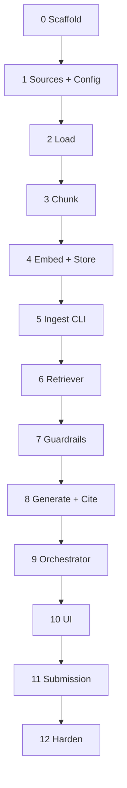

# Implementation Guide: Mutual Fund Facts-Only RAG Chatbot

**Based on:** [architecture.md](./architecture.md) · [PRD.md](./PRD.md)  
**How to use:** Run **one phase per Cursor chat turn**. Paste the **Cursor prompt** at the end of that phase. Do not start the next phase until the **Done when** checklist passes.

**Defaults (lock these unless you decide otherwise):**

| Decision | Default for implementation |
|----------|----------------------------|
| UI | Streamlit |
| LLM | OpenAI-compatible API via `OPENAI_API_KEY` (env); model configurable in `src/config.py` |
| Snapshots | Fetch once during ingest; also save under `data/snapshots/` for offline re-runs |
| Orchestration | Thin custom Python (not a heavy LangChain app)—LangChain splitters/Chroma helpers OK if they keep stages obvious |

---

## Phase map

| Phase | Name | Depends on | RAG stages touched |
|-------|------|------------|--------------------|
| 0 | Project scaffold | — | — |
| 1 | Sources + config | 0 | — |
| 2 | Load | 1 | Load |
| 3 | Chunk | 2 | Chunk |
| 4 | Embed + Store | 3 | Embed, Store |
| 5 | Ingest CLI (wire pipeline) | 4 | Full ingestion |
| 6 | Retriever | 5 | Retrieve |
| 7 | Guardrails | 6 | Guardrails |
| 8 | Generate + cite | 7 | Generate, Cite |
| 9 | Orchestrator | 8 | Full runtime path |
| 10 | Streamlit UI | 9 | UI |
| 11 | Submission pack | 10 | Deliverables |
| 12 | Demo harden + verify | 11 | Polish |



---

## Global rules for every Cursor prompt

Always include these constraints when prompting:

1. Follow `docs/architecture.md` layout and stage names.  
2. Implement **only this phase**—do not build later phases early.  
3. Keep ingestion under `src/ingest/` and retrieval under `src/retrieve/`.  
4. No investment advice logic that recommends buy/sell.  
5. Do not store PII.  
6. Prefer small, readable modules over frameworks.  
7. Update nothing in `docs/PRD.md` / `docs/architecture.md` unless asked.

**Pasteable preamble (optional, prepend to any phase prompt):**

```text
Read docs/architecture.md and docs/implementation.md.
Implement ONLY the phase I specify below. Do not start later phases.
Match the repo layout in architecture.md §6. Keep stages clearly separated.
```

---

## Phase 0 — Project scaffold

### Goal
Empty but runnable Python project skeleton matching architecture layout.

### Create
- `requirements.txt` (placeholders OK: `chromadb`, `sentence-transformers`, `streamlit`, `beautifulsoup4`, `requests`, `python-dotenv`, `openai` or equivalent)
- `src/__init__.py`, `src/ingest/__init__.py`, `src/retrieve/__init__.py`, `src/app/__init__.py`
- `src/config.py` stub (paths only; real constants in Phase 1)
- `.gitignore` (`chroma/`, `.env`, `__pycache__/`, `.venv/`, model caches)
- `README.md` stub: one paragraph + “setup TBD”

### Do not
- Implement loaders, Chroma, or UI logic yet.

### Done when
- [ ] Folder tree matches architecture §6 (empty modules OK)
- [ ] `.gitignore` excludes vector store and secrets
- [ ] `pip install -r requirements.txt` is documented as next step (install may wait until Phase 4/5)

### Cursor prompt

```text
Phase 0 only from docs/implementation.md.

Create the project scaffold per docs/architecture.md §6:
- requirements.txt with chromadb, sentence-transformers, streamlit, beautifulsoup4, requests, python-dotenv, openai
- src package with ingest/, retrieve/, app/ __init__ files
- src/config.py stub with project root / data / chroma path helpers only
- .gitignore for chroma/, .env, venv, caches
- README.md stub

Do not implement ingestion, retrieval, or UI logic. Stop when the tree exists.
```

---

## Phase 1 — Sources + config

### Goal
Canonical list of 5 HDFC schemes and shared config defaults.

### Create / edit
- `data/sources.csv` with columns: `category,scheme_name,url`
- Fill all 5 URLs from PRD §5.1
- `src/config.py`:
  - `CHUNK_SIZE = 600`
  - `CHUNK_OVERLAP = 100`
  - `TOP_K = 4`
  - `EMBEDDING_MODEL = "sentence-transformers/all-MiniLM-L6-v2"`
  - `CHROMA_PATH`, `CHROMA_COLLECTION = "hdfc_mf_faqs"`
  - `SNAPSHOTS_DIR = data/snapshots`
  - `SOURCES_CSV = data/sources.csv`
  - LLM model name + env var name for API key

### Done when
- [ ] Exactly 5 rows in `sources.csv`
- [ ] Config constants match architecture §10
- [ ] No network / embedding code yet

### Cursor prompt

```text
Phase 1 only from docs/implementation.md.

Create data/sources.csv with the 5 HDFC Groww URLs from docs/PRD.md §5.1
(columns: category, scheme_name, url).

Expand src/config.py with CHUNK_SIZE=600, CHUNK_OVERLAP=100, TOP_K=4,
EMBEDDING_MODEL=sentence-transformers/all-MiniLM-L6-v2,
CHROMA_PATH, CHROMA_COLLECTION=hdfc_mf_faqs, SNAPSHOTS_DIR, SOURCES_CSV,
and LLM settings via env (OPENAI_API_KEY).

No scraping, embedding, or UI. Stop after sources + config.
```

---

## Phase 2 — Load

### Goal
Load stage: turn each source row into cleaned plain text + metadata.

### Create
- `src/ingest/load.py`
  - `load_sources()` → read CSV
  - `fetch_or_read_snapshot(url, scheme_name)` → try snapshot file first; else HTTP GET; save snapshot under `data/snapshots/`
  - `html_to_text(html)` → BeautifulSoup; strip script/style/nav; return main text
  - `load_documents()` → list of dicts: `{text, source_url, scheme_name, category, ingested_at}`

### Rules
- Prefer snapshots when present (offline demo).
- Record ISO `ingested_at` per document.
- Fail clearly if a page is empty after cleaning.

### Done when
- [ ] Can load all 5 docs in a small `__main__` or pytest-free script print (scheme name + char count)
- [ ] Snapshots written under `data/snapshots/`
- [ ] No chunking / Chroma yet

### Cursor prompt

```text
Phase 2 only from docs/implementation.md and architecture.md §4.1 Load.

Implement src/ingest/load.py:
- read data/sources.csv
- fetch each URL (requests) or reuse data/snapshots/ if present
- save snapshots for offline re-use
- BeautifulSoup clean to plain text
- return documents with text, source_url, scheme_name, category, ingested_at

Add a simple `if __name__ == "__main__"` that prints scheme_name and text length for each doc.
Do not chunk, embed, or write to Chroma.
```

---

## Phase 3 — Chunk

### Goal
Chunk stage: RecursiveCharacterTextSplitter over loaded documents.

### Create
- `src/ingest/chunk.py`
  - Use recursive separators: `["\n\n", "\n", ". ", " ", ""]`
  - `chunk_size` / `chunk_overlap` from config
  - Output chunks: `{id, text, source_url, scheme_name, category, ingested_at, chunk_index}`
  - Stable `id` = hash(scheme_name + chunk_index) or similar

### Done when
- [ ] Running chunker on loaded docs prints total chunk count (>0 per scheme)
- [ ] Metadata preserved on every chunk
- [ ] No embeddings yet

### Cursor prompt

```text
Phase 3 only from docs/implementation.md and architecture.md §4.1 Chunk.

Implement src/ingest/chunk.py using RecursiveCharacterTextSplitter
(chunk_size=600, overlap=100 from config; separators \n\n, \n, ". ", space).
Input: documents from load.load_documents().
Output: chunks with id, text, source_url, scheme_name, category, ingested_at, chunk_index.

Add __main__ that loads + chunks and prints counts per scheme.
Do not embed or store in Chroma yet.
```

---

## Phase 4 — Embed + Store

### Goal
Embed chunks with MiniLM and persist to ChromaDB.

### Create
- `src/ingest/embed_store.py`
  - Load embedding model from config
  - Create/get Chroma collection `hdfc_mf_faqs`
  - Upsert: ids, documents (text), metadatas, embeddings
  - Helper `reset_collection()` for clean re-ingest (demo-friendly)
  - Helper `collection_count()` for sanity check

### Notes
- Persist under `chroma/` path from config.
- Metadata values must be Chroma-safe (str/int/float/bool).

### Done when
- [ ] Function accepts chunk list and writes to Chroma
- [ ] Re-running upsert does not crash (reset or upsert by id)
- [ ] Can print collection count after write
- [ ] Still no CLI wiring required (that’s Phase 5)—but a `__main__` smoke path is OK

### Cursor prompt

```text
Phase 4 only from docs/implementation.md and architecture.md §4.1 Embed/Store.

Implement src/ingest/embed_store.py:
- sentence-transformers/all-MiniLM-L6-v2
- ChromaDB persistent client at config CHROMA_PATH
- collection hdfc_mf_faqs
- upsert chunks with metadata source_url, scheme_name, category, ingested_at, chunk_index
- reset_collection() and collection_count() helpers

Optional __main__: load → chunk → embed_store and print count.
Do not build the full CLI module yet (Phase 5) and do not build retrieval/UI.
```

---

## Phase 5 — Ingest CLI (full ingestion pipeline)

### Goal
One command runs Load → Chunk → Embed → Store end-to-end.

### Create
- `src/ingest/run_ingest.py`
  - CLI: `python -m src.ingest.run_ingest` (or `python src/ingest/run_ingest.py`)
  - Flags: `--reset` to clear collection first
  - Logs stage progress: Loading… Chunking… Embedding… Stored N chunks
- Ensure `data/snapshots/` populated after run

### Done when
- [ ] Fresh run builds Chroma with N > 0 chunks
- [ ] Second run with `--reset` rebuilds cleanly
- [ ] Stages are visibly logged in order

### Cursor prompt

```text
Phase 5 only from docs/implementation.md.

Implement src/ingest/run_ingest.py as the CLI entry that runs:
load_documents → chunk_documents → embed_and_store.
Print clear stage logs (Load, Chunk, Embed, Store) and final chunk count.
Support --reset to clear the Chroma collection first.

Wire existing Phase 2–4 modules; do not implement retrieval or UI.
After coding, show the exact command to run ingestion.
```

---

## Phase 6 — Retriever

### Goal
Runtime retrieve: embed query, Chroma similarity search, return top-k chunks.

### Create
- `src/retrieve/retriever.py`
  - `retrieve(question: str, top_k: int | None = None, scheme_name: str | None = None) -> list[dict]`
  - Same MiniLM model as ingest
  - Optional metadata filter when `scheme_name` provided
  - Return text + metadata + distance/score if available
- Fail with a clear error if collection missing / empty

### Done when
- [ ] After Phase 5 ingest, querying “expense ratio large cap” returns relevant chunks
- [ ] `__main__` smoke test prints top chunk texts + source_url
- [ ] No LLM generation yet

### Cursor prompt

```text
Phase 6 only from docs/implementation.md and architecture.md §4.2 Retrieve.

Implement src/retrieve/retriever.py:
- embed query with same MiniLM model as ingest
- Chroma similarity search top_k from config (default 4)
- optional scheme_name metadata filter
- return list of {text, metadata, score?}
- clear error if index missing

Add __main__ smoke test with a sample factual query.
Do not add LLM answers or UI yet.
```

---

## Phase 7 — Guardrails

### Goal
Refuse advice, block PII, and redirect performance questions before generation.

### Create
- `src/retrieve/guardrails.py`
  - `check_question(question) -> {ok: bool, reason: str | None, refusal_message: str | None, kind: advice|pii|performance|None}`
  - Keyword / regex heuristics are enough for the class demo:
    - Advice: buy, sell, should I, best fund, recommend, suitable for me
    - Performance: highest return, beat the market, which will perform, compare returns
    - PII: PAN-like, Aadhaar-like, OTP, email, phone patterns; account number heuristics
  - Refusal copy: polite, facts-only, invite a factual parameter question; optional educational link placeholder

### Done when
- [ ] “Should I buy HDFC Small Cap?” → not ok, advice
- [ ] “What is the exit load of HDFC Small Cap?” → ok
- [ ] Question containing an email → not ok, pii
- [ ] No Chroma/LLM calls inside guardrails

### Cursor prompt

```text
Phase 7 only from docs/implementation.md and architecture.md §8.

Implement src/retrieve/guardrails.py with check_question() that detects:
- investment advice / buy-sell opinion
- performance comparison / return prediction
- PII (email, phone, PAN/Aadhaar-like, OTP)

Return structured result with ok flag, kind, and refusal_message.
Include a small __main__ with 4–5 example strings showing pass/fail.
Do not call Chroma or the LLM.
```

---

## Phase 8 — Generate + cite

### Goal
Grounded LLM answer ≤3 sentences + exactly one source URL + last updated line.

### Create
- `src/retrieve/generate.py`
  - `generate_answer(question, chunks) -> {answer, source, last_updated_from_sources, refused: false}`
  - System prompt rules:
    - Use only provided context
    - Never invent numbers
    - If insufficient → say not found in sources
    - Max 3 sentences in the fact body
  - Citation = `source_url` of best (first / highest-ranked) chunk
  - `last_updated_from_sources` from chunk `ingested_at`
  - Read API key from env; clear error if missing

### Done when
- [ ] Given mock chunks with expense ratio text, answer cites that URL
- [ ] Empty chunks → not-found style answer (still safe)
- [ ] No Streamlit yet

### Cursor prompt

```text
Phase 8 only from docs/implementation.md and architecture.md §4.2 Generate/Cite and §7.3.

Implement src/retrieve/generate.py:
- build a context-only prompt from retrieved chunks
- call OpenAI-compatible chat API using env OPENAI_API_KEY and model from config
- answer ≤3 sentences, no invented numbers
- always return exactly one source URL from the top chunk metadata
- include last_updated_from_sources from ingested_at
- if no chunks, return a not-found message without hallucinating facts

Do not build the full orchestrator or UI yet; a __main__ with fake chunks is enough to smoke-test formatting.
```

---

## Phase 9 — Orchestrator

### Goal
Single `answer_question(question)` wiring guardrails → retrieve → generate.

### Create
- `src/retrieve/orchestrator.py` (or `src/app/orchestrator.py` if you prefer; keep import clear)
  - Flow:
    1. `check_question`
    2. If not ok → return refusal payload (`refused: true`, optional source)
    3. Optional: naive scheme hint extraction from question text vs known scheme names
    4. `retrieve(...)`
    5. `generate_answer(...)`
  - Return the architecture §7.3 response shape

### Done when
- [ ] Fact question returns answer + source + last_updated + refused=false
- [ ] Advice question returns refusal without calling generate (or without using LLM for advice)
- [ ] `__main__` interactive or 2–3 hardcoded demos work after ingest + API key

### Cursor prompt

```text
Phase 9 only from docs/implementation.md and architecture.md §3–4.2.

Implement src/retrieve/orchestrator.py with answer_question(question) that:
1) runs guardrails
2) on refusal, returns refused payload without generating advice
3) otherwise retrieves top-k (optional scheme filter if name detected)
4) generates grounded answer with one citation

Match output fields: answer, source, last_updated_from_sources, refused.
Add __main__ demos: one factual, one advice question.
Assume Chroma was built in Phase 5. No Streamlit UI yet.
```

---

## Phase 10 — Streamlit UI

### Goal
Tiny demo UI: welcome, disclaimer, 3 examples, chat.

### Create
- `src/app/ui.py`
  - Title / welcome one-liner for HDFC MF facts assistant
  - Always-visible: **Facts-only. No investment advice.**
  - Full disclaimer from PRD §8
  - Three clickable example questions from PRD Appendix A
  - Chat input → `answer_question`
  - Render answer body + Source link + Last updated
  - If index missing, show “Run ingestion first” with the CLI command

### Do not
- Build dashboards, auth, or multi-page apps.

### Done when
- [ ] `streamlit run src/app/ui.py` opens usable chat
- [ ] Example buttons populate/send a question
- [ ] Refusal and fact answers both display correctly

### Cursor prompt

```text
Phase 10 only from docs/implementation.md and architecture.md §9.

Implement src/app/ui.py with Streamlit:
- welcome line for HDFC mutual fund facts assistant
- persistent note: Facts-only. No investment advice.
- longer disclaimer from docs/PRD.md §8
- 3 example questions from PRD Appendix A (clickable)
- chat that calls orchestrator.answer_question
- show answer, Source URL, Last updated from sources
- friendly error if Chroma index missing

Keep the UI minimal—single page, no dashboards. Show the run command when done.
```

---

## Phase 11 — Submission pack

### Goal
Class deliverables: README, sources list, sample Q&A, disclaimer snippet.

### Create / update
- `README.md`: setup (venv, install, `.env`, ingest, streamlit), scope (AMC + 5 schemes), known limits, RAG stage map
- Ensure `data/sources.csv` (or `data/sources.md` export) is submission-ready
- `samples/sample_qa.md`: 5–10 queries with actual assistant answers + links (run the app / orchestrator to capture)
- `samples/disclaimer.md`: exact UI disclaimer text
- Optional: `docs/known_limits.md` only if README would be too long—prefer keeping limits inside README

### Done when
- [ ] Someone else can run from README alone
- [ ] Sample Q&A includes both a fact and a refusal example
- [ ] Source list has exactly the 5 URLs

### Cursor prompt

```text
Phase 11 only from docs/implementation.md and PRD §10 deliverables.

Update README.md with: setup steps, AMC/scheme scope, RAG stage overview
(Load→Chunk→Embed→Store→Retrieve→Generate), and known limits.

Create samples/disclaimer.md with the exact UI disclaimer.
Create samples/sample_qa.md with 5–10 Q&As (include at least one refusal).
If needed, add a short data/sources.md mirroring the CSV.

Do not refactor the RAG pipeline unless required for docs accuracy.
Capture real answers by running the orchestrator when possible.
```

---

## Phase 12 — Demo harden + verify

### Goal
Demo-day reliability and PRD success checklist.

### Tasks
- Re-run ingest from snapshots (no network) and confirm UI still works
- Verify PRD §11 checklist manually; fix gaps only
- Tune only if needed: `chunk_size`, `overlap`, `top_k`
- Add `.env.example` with `OPENAI_API_KEY=` and model name comment
- Confirm `.gitignore` excludes `.env` and `chroma/`
- Optional degraded path: if LLM down, show top retrieved snippet + source (only if time)

### Done when (PRD success criteria)
- [ ] Expense ratio / exit load / min SIP / ELSS lock-in → grounded fact + correct URL  
- [ ] “Should I buy?” → refusal  
- [ ] Returns question → no invented numbers; points to official page  
- [ ] UI has welcome, 3 examples, facts-only disclaimer  
- [ ] README documents stages clearly  
- [ ] All §10 deliverables present  

### Cursor prompt

```text
Phase 12 only from docs/implementation.md.

Harden for class demo against docs/PRD.md §11 success criteria:
- add .env.example
- verify ingest works from snapshots offline
- fix any gaps in refusal / citation / README stage docs
- lightly tune chunk/top_k only if retrieval is clearly wrong

Do not add new features (no auth, no extra AMCs, no return calculators).
Report a short checklist of what passed and what you fixed.
```

---

## Suggested Cursor session pattern

1. Open a new agent chat (or clearly mark “Phase N”).  
2. Paste **Global preamble** + **Phase N Cursor prompt**.  
3. Run the phase’s smoke command yourself.  
4. Check **Done when**.  
5. Only then start Phase N+1 (new prompt).  

If a phase fails, stay on that phase: paste the error + “fix Phase N only; do not start Phase N+1.”

---

## Quick smoke commands (fill in as you implement)

```bash
# after Phase 0–1
python -m venv .venv
# Windows: .venv\Scripts\activate
pip install -r requirements.txt

# Phase 2
python -m src.ingest.load

# Phase 3
python -m src.ingest.chunk

# Phase 5
python -m src.ingest.run_ingest --reset

# Phase 6
python -m src.retrieve.retriever

# Phase 9
python -m src.retrieve.orchestrator

# Phase 10
streamlit run src/app/ui.py
```

---

## Phase ↔ architecture ↔ PRD traceability

| Phase | Architecture | PRD |
|-------|--------------|-----|
| 0–1 | §5–6 layout, §10 config | Scope / corpus |
| 2–5 | §4.1 ingestion | FR-1 |
| 6 | §4.2 retrieve | FR-2 |
| 7 | §8 guardrails | FR-5, FR-6, FR-7 |
| 8–9 | §4.2 generate/cite, §7.3 | FR-3, FR-4, FR-8, FR-9 |
| 10 | §9 UI | Goals P0 UI |
| 11–12 | §13 demo narrative | §10–11 deliverables / success |
